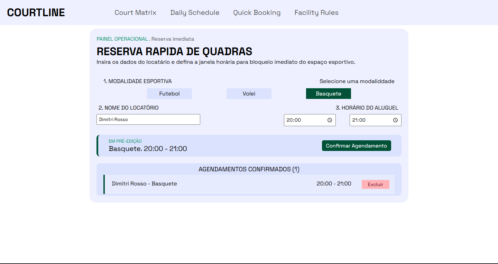

# ⚽ Sistema de Agendamentos Esportivos

Sistema web desenvolvido para realizar e organizar agendamentos de espaços esportivos. A aplicação permite que o usuário informe seu nome, escolha uma modalidade esportiva, defina horário de entrada e saída e visualize os agendamentos confirmados.

O projeto foi desenvolvido com **HTML, CSS e JavaScript no Front-end**, **Node.js e Express no Back-end** e **MySQL** para armazenamento dos dados.

## 📸 Demonstração



## 📌 Funcionalidades

- Cadastro de novos agendamentos
- Seleção de modalidade esportiva
- Definição de horário de entrada e saída
- Exibição dos agendamentos confirmados
- Exclusão de agendamentos
- Integração entre Front-end, API e banco de dados
- Atualização da quantidade de agendamentos confirmados

## 🖥️ Tecnologias utilizadas

### Front-end

- HTML5
- CSS3
- JavaScript

### Back-end

- Node.js
- Express
- CORS
- mysql2
- dotenv

### Banco de dados

- MySQL

## 🏗️ Estrutura do projeto

O projeto é dividido em duas partes principais:

```text
projeto/
│
├── frontend/
│   ├── index.html
│   ├── style.css
│   └── script.js
│
└── backend/
    ├── server.js
    ├── package.json
    └── .env
```

> A estrutura dos arquivos pode variar de acordo com a organização utilizada no projeto.

## 🔄 Funcionamento

O sistema utiliza uma comunicação entre o Front-end, o Back-end e o banco de dados.

```text
Usuário
   ↓
Front-end
   ↓
Fetch / API
   ↓
Express
   ↓
MySQL
```

## 🔌 Principais rotas da API

| Método   | Rota           | Função                        |
| -------- | -------------- | ----------------------------- |
| `POST`   | `/cadastrar`   | Cadastra um novo agendamento  |
| `DELETE` | `/deletar/:id` | Exclui um agendamento pelo ID |

## 🗄️ Banco de dados

O sistema utiliza uma tabela `agendamento` para armazenar os dados.

Exemplo de estrutura:

| Campo              | Descrição                            |
| ------------------ | ------------------------------------ |
| `id`               | Identificador único do agendamento   |
| `nome`             | Nome do responsável pelo agendamento |
| `esporte`          | Modalidade esportiva escolhida       |
| `horario__entrada` | Horário de início                    |
| `horario__saida`   | Horário de término                   |

O campo `id` é utilizado para identificar cada agendamento individualmente.

````

## 🚀 Como executar o projeto

### 1. Clonar o repositório

```bash
git clone https://github.com/dimitrirosso/courtline-agendamento
````

### 2. Entrar na pasta do projeto

```bash
cd trteino
```

### 3. Instalar as dependências

Na pasta do Back-end:

```bash
npm install
```

### 4. Configurar o banco de dados

Crie o banco de dados MySQL e a tabela `agendamento`.

Depois configure as informações de conexão no arquivo `.env`.

### 5. Iniciar o servidor

```bash
node server.js
```

O servidor será iniciado na porta configurada na aplicação.

Exemplo:

```text
http://localhost:3000
```

### 6. Abrir o Front-end

Abra o arquivo `index.html` no navegador ou execute o Front-end utilizando a ferramenta de desenvolvimento escolhida.

## 📚 O que foi praticado

Durante o desenvolvimento deste projeto foram praticados conceitos importantes de desenvolvimento Web, como:

- Manipulação do DOM
- Eventos JavaScript
- `addEventListener`
- `fetch`
- Requisições HTTP
- Métodos `GET`, `POST` e `DELETE`
- JSON
- APIs REST
- Node.js
- Express
- Rotas
- `async/await`
- SQL
- Conexão entre Back-end e banco de dados
- Variáveis de ambiente com `.env`
- CORS
- Comunicação entre Front-end e Back-end

## 🎯 Objetivo do projeto

O projeto foi desenvolvido com o objetivo de praticar a construção de uma aplicação web completa, trabalhando não apenas a interface, mas também a comunicação entre Front-end, Back-end e banco de dados.

A aplicação representa um fluxo completo de cadastro e gerenciamento de informações, desde a interação do usuário até o armazenamento dos dados no banco de dados.

## 👨‍💻 Autor

**Dimitri Rosso**

Projeto desenvolvido para fins de estudo e prática em desenvolvimento de sistemas.
